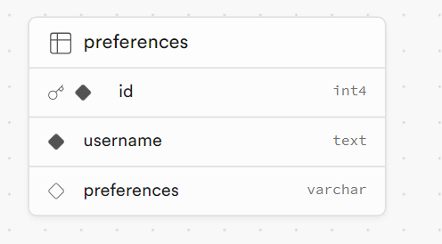

WEEK 5 Project
our Trello board:

database schema:

Our user stories which you can see on the screenshot above under 'our trello board'. We set out our goals and targets at the beginning of the project and by following through it step-by-step we achieved our project.

There were a few stretch goals that we put down and would have implemented if we had enough time to do so which would've made the overall app be more polished and precise to what we ideally wanted.

Things we found difficult during the start of the project was querying the database from the client, but with the help of a staff member we were able to overcome this. Moreover, deploying our completed app on render was another obstacle, as first of all once it deployed we had an error on our site with the sound and then there was an issue with deployment as it kept failing. Again with the help from staff members we were able to get this sorted and up and running again after a good few attempts at trying different things.

Overall, we are happy with the outcome of our app given the time frame and team work made what we wanted possible!

STEP BY STEP GUIDE ON OUR APP:

1. follow this link to access our app:
   https://week5-project-1.onrender.com/

2. A pop-up should appear to 'enter username if you already have one' i.e your username can be anything!
   If you DO NOT have a username then just press the 'submit' button and it will direct you to the main page of the app.

3. At the bottom of the page there is a 'add new user' form which you can input your details and also input your preference to 'light' or 'dark' which would change the background colour of the page when you next log in.

4. You can click on the button which best suits your mood which will then be followed by a sound that implements that specific mood.

SOURCES:

Google fonts
Kevin Powell’s videos: https://www.youtube.com/@KevinPowell
Pixabay audio
Splice audio
Glowing button tutorial: https://www.youtube.com/watch?v=b_8fHNIHFk4&ab_channel=CodingPlay
Joe Ventons ginormous brain
